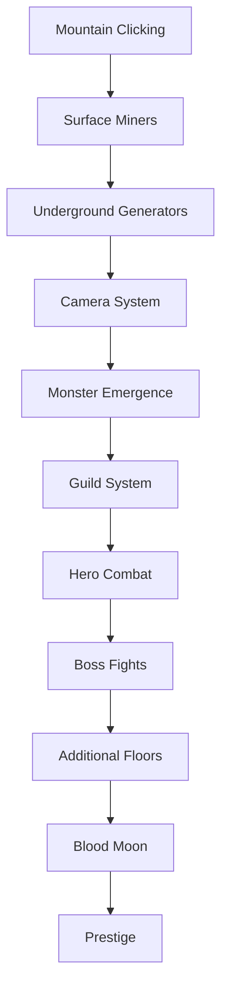

# PLANNING.md - Dungeon Delver Development Roadmap

## Project Setup & Foundation (Day 1)

### Initial HTML/CSS Structure
```html
<!-- Basic structure needed -->
- Canvas element (960x640 recommended)
- UI container divs for top bar and bottom panel
- Modal container for guild popup
- Load pixel fonts (Google Fonts: Press Start 2P)
```

### Core Game Loop
```javascript
// Priority 1: Get the basic loop running
- requestAnimationFrame setup
- Delta time calculation
- Update loop (economy, animations)
- Render loop (canvas drawing)
- FPS counter for performance monitoring
```

### File Organization
```
/index.html
/style.css
/js/
  main.js          // Entry point, game initialization
  game.js          // Core game state and loop
  renderer.js      // All canvas drawing
  economy.js       // Generators and gold management
  ui.js           // UI components and interactions
  utils.js        // Helper functions (number formatting, etc.)
```

---

## Phase 1: Core Mining Mechanic (Days 2-3)

### Goal: Playable clicking game with surface mining

### Tasks:
1. **Mountain Clicking (2 hours)**
   - [ ] Draw mountain sprite on canvas
   - [ ] Detect clicks on mountain area
   - [ ] Add gold to counter on click
   - [ ] Show +gold floating text animation
   - [ ] Add pickaxe cursor on hover

2. **Gold Display System (1 hour)**
   - [ ] Format numbers (1K, 1M, 1B notation)
   - [ ] Smooth ticker animation for gold counter
   - [ ] GPS (Gold Per Second) calculation
   - [ ] Top bar UI implementation

3. **Surface Miners (2 hours)**
   - [ ] Create Generator class
   - [ ] Implement surface miner (-1 floor)
   - [ ] Purchase button with cost scaling
   - [ ] Animated miner sprites at camp
   - [ ] Income calculation and automatic gold generation

4. **Visual Polish (2 hours)**
   - [ ] Particle effects on click
   - [ ] Screen shake on purchase
   - [ ] Purchase sound effects
   - [ ] Sky gradient and cloud animations
   - [ ] Mining camp comes alive when miners purchased

5. **Save System (1 hour)**
   - [ ] Save to localStorage every 10 seconds
   - [ ] Load game state on refresh
   - [ ] Calculate offline progress
   - [ ] Reset button for testing

### Success Criteria:
- Can click mountain for gold
- Can buy miners that generate passive income
- Numbers format correctly and update smoothly
- Game saves and loads properly
- Feels satisfying (particles, sounds, animations)

---

## Phase 2: Underground Expansion (Days 4-5)

### Goal: Camera transition and first 3 underground floors

### Tasks:
1. **Camera System (3 hours)**
   - [ ] Implement camera Y position tracking
   - [ ] Create dramatic pan animation (easeInOutCubic)
   - [ ] Trigger on first underground purchase
   - [ ] Screen shake during transition
   - [ ] Lock controls during animation

2. **Underground Generators (3 hours)**
   - [ ] Drill Operator (Floor 1)
   - [ ] Blast Engineer (Floor 2)
   - [ ] Crystal Harvester (Floor 3)
   - [ ] Visual sprites for each generator
   - [ ] Animated production effects

3. **Split Screen Layout (2 hours)**
   - [ ] Left side: Economy view
   - [ ] Right side: Dungeon view (dimmed initially)
   - [ ] Thick wall separator between sides
   - [ ] Floor-by-floor visual structure
   - [ ] Stone texture borders

4. **UI Bottom Panel (2 hours)**
   - [ ] Economy upgrades section (left)
   - [ ] Click upgrades section (right)
   - [ ] Guild button (center) - inactive for now
   - [ ] Upgrade buttons with costs
   - [ ] Progress bars for multi-level upgrades

### Success Criteria:
- Camera pans dramatically to underground
- Can purchase 3 underground generators
- Visual separation between economy and dungeon sides
- Bottom panel shows upgrade options
- Each floor has unique visual theme

---

## Phase 3: The Breach - Combat Introduction (Days 6-8)

### Goal: Monsters emerge, guild system activated

### Tasks:
1. **Monster System (3 hours)**
   - [ ] Monster spawn at Floor 4
   - [ ] Block generator purchase on Floor 4
   - [ ] Monster sprite animations
   - [ ] Right side illumination effect
   - [ ] Monster idle animations

2. **Guild Building (4 hours)**
   - [ ] Guild button activation (5,000 gold)
   - [ ] Guild popup modal creation
   - [ ] Tab system for upgrade paths
   - [ ] Initial warrior class only
   - [ ] Purchase and upgrade mechanics

3. **Hero System (4 hours)**
   - [ ] Hero class with basic stats
   - [ ] Spawn heroes from guild
   - [ ] Lemming-style pathfinding
   - [ ] Move through dungeon right to left
   - [ ] Basic combat (auto-attack)

4. **Combat Resolution (3 hours)**
   - [ ] Health bars for heroes and monsters
   - [ ] Damage calculation
   - [ ] Death and respawn system
   - [ ] Combat animations (sword swings)
   - [ ] Damage numbers floating

5. **Boss Fight (2 hours)**
   - [ ] Boss sprite at leftmost position
   - [ ] Boss health bar UI
   - [ ] Special boss abilities
   - [ ] Floor sealing on boss defeat
   - [ ] Victory effects and sounds

### Success Criteria:
- Monsters block progression at Floor 4
- Can build guild and spawn heroes
- Heroes automatically path through dungeon
- Combat resolves automatically
- Defeating boss unlocks next floor

---

## Phase 4: Full Combat & Progression (Days 9-11)

### Goal: Floors 5-8, multiple hero classes, full guild tree

### Tasks:
1. **Additional Floors (3 hours)**
   - [ ] Implement Floors 5-8
   - [ ] Unique boss for each floor
   - [ ] Scaling monster difficulty
   - [ ] New generator types
   - [ ] Visual themes per floor

2. **Hero Classes (4 hours)**
   - [ ] Archer (ranged DPS)
   - [ ] Rogue (fast, crit chance)
   - [ ] Cleric (healer)
   - [ ] Unique sprites for each
   - [ ] Class-specific abilities

3. **Guild Upgrade Tree (4 hours)**
   - [ ] Branching path system
   - [ ] Visual tree connections
   - [ ] Requirement checking
   - [ ] Purchase effects
   - [ ] Stats sidebar

4. **Economy Upgrades (2 hours)**
   - [ ] Miner Efficiency (10 levels)
   - [ ] Global Production (20 levels)
   - [ ] Deeper Drills (15 levels)
   - [ ] Cost scaling and effects

5. **Click Upgrades (2 hours)**
   - [ ] Click Power (10 levels)
   - [ ] Auto-Clicker (5 levels)
   - [ ] Gold Rush ability
   - [ ] Click percentage of GPS

### Success Criteria:
- Multiple hero classes with different roles
- Complex guild upgrade tree works
- Economy and click upgrades provide meaningful progression
- Can reach Floor 8 with proper strategy
- Balance between economy and military investment

---

## Phase 5: Blood Moon & Polish (Days 12-14)

### Goal: End-game content, visual polish, game feel

### Tasks:
1. **Blood Moon System (4 hours)**
   - [ ] Timer system (5-10 minute intervals)
   - [ ] Warning countdown UI
   - [ ] Screen tint red effect
   - [ ] Wall breach mechanics
   - [ ] Monster invasion of economy side
   - [ ] Production pause on breached floors

2. **Power-Up System (2 hours)**
   - [ ] Floating gold sacks
   - [ ] Click to collect mechanics
   - [ ] Temporary boost effects
   - [ ] Hero power-ups
   - [ ] Visual spawn system

3. **Prestige System (3 hours)**
   - [ ] Unlock at Floor 12
   - [ ] Soul calculation
   - [ ] Permanent upgrades shop
   - [ ] Reset with bonuses
   - [ ] Collapse animation

4. **Visual Polish (3 hours)**
   - [ ] All particle effects
   - [ ] Screen shake variations
   - [ ] Achievement popups
   - [ ] Number formatting animations
   - [ ] Transition effects

5. **Audio (2 hours)**
   - [ ] 8-bit soundtrack
   - [ ] Purchase sounds (scaled by cost)
   - [ ] Combat sounds
   - [ ] Victory fanfares
   - [ ] Blood Moon alarm

### Success Criteria:
- Blood Moon creates tension and requires active play
- Prestige provides meta-progression
- Game feels polished and satisfying
- All visual effects working
- Audio enhances experience

---

## Phase 6: Optimization & Testing (Days 15-16)

### Goal: Performance, balance, bug fixes

### Tasks:
1. **Performance Optimization**
   - [ ] Object pooling for particles
   - [ ] Sprite batching
   - [ ] Only animate visible entities
   - [ ] Memory leak detection
   - [ ] Mobile touch support

2. **Balance Testing**
   - [ ] Time to first boss: ~20 minutes
   - [ ] Time to prestige: 6-8 hours
   - [ ] Gold income vs costs curve
   - [ ] Hero success rates
   - [ ] Blood Moon difficulty

3. **Bug Fixes**
   - [ ] Save system edge cases
   - [ ] Number overflow handling
   - [ ] Animation glitches
   - [ ] UI responsiveness
   - [ ] Cross-browser testing

4. **Polish**
   - [ ] Tutorial/onboarding
   - [ ] Settings menu (volume, quality)
   - [ ] Statistics tracking
   - [ ] Achievement system
   - [ ] Credits screen

---

## Technical Milestones & Checkpoints

### ✅ Checkpoint 1 (End of Phase 1) - COMPLETED:
- **What works**: Complete idle game with clicking, passive income, and upgrades
- **Playtest focus**: Clicking is satisfying with particles/shake, numbers scale well
- **Key metric**: Can reach Floor 3 (10K gold) in reasonable time ✅
- **Status**: Fully playable with professional polish

### ✅ Checkpoint 2 (End of Phase 2) - COMPLETED:
- **What works**: Underground expansion with 4 generators across 3 floors + surface
- **Playtest focus**: Camera pan works well, interactive floor building is intuitive
- **Key metric**: Can unlock all 3 underground floors with strategic upgrade choices ✅  
- **Status**: Ready for combat system (monsters/heroes)

### ✅ Checkpoint 3 (Phase 2 Complete + UI Foundation) - COMPLETED:
- **What works**: Complete combat system with boss battles + bulletproof UI system
- **Playtest focus**: Boss battles are engaging, UI is responsive and professional ✅
- **Key metric**: Can defeat Goblin Chief boss and unlock Floor 4 generator ✅
- **Status**: Foundation ready for complex guild management system

### Checkpoint 4 (End of Phase 4):
- **What works**: Full progression to Floor 8 with all systems
- **Playtest focus**: Is strategy meaningful? Are upgrades balanced?
- **Key metric**: Can reach Floor 8 in 2 hours

### Checkpoint 5 (End of Phase 5):
- **What works**: Complete game with all features
- **Playtest focus**: Is Blood Moon fun? Does prestige feel rewarding?
- **Key metric**: First prestige in 6-8 hours

---

## ✅ MAJOR SESSION ACHIEVEMENT: UI System Stabilization (Latest Session)

### 🎆 Cookie Clicker Architecture Implementation Complete
**Session Goal**: Eliminate UI responsiveness issues and game stability problems
**Result**: Professional-grade UI system with immediate button responsiveness

#### ✅ Critical Problems Solved:
1. **Button Responsiveness**: New generator buttons now work immediately when unlocked (no manual resize required)
2. **Game Stability**: Eliminated lockups during mountain clicking with stable state management
3. **Visual Polish**: Clean icon-only upgrade buttons with professional hover tooltips
4. **Performance**: 60 FPS maintained with efficient UI updates (no expensive recreation)
5. **Scalability**: UI architecture supports unlimited additional generators and upgrades

#### 🔧 Technical Implementation:
- **Pre-create All UI Elements**: Cookie Clicker approach - create all buttons at startup
- **State-Only Updates**: Only visibility and interactivity updated during gameplay
- **Generator Availability Logic**: Proper threshold system (100g→Drill, 1K→Blast, 10K→Crystal)
- **Icon Display System**: Upgrade buttons show ⛏️💰 icons with detailed hover information
- **Safe Update Patterns**: Eliminated problematic UI recreation that caused lockups

#### 🎮 Player Experience Impact:
- **Immediate Response**: Buttons work the moment they become available
- **Professional Feel**: Clean, responsive interface with no glitches or delays
- **Consistent Behavior**: All interactions work reliably across all screen sizes
- **Hover Information**: Rich tooltips provide detailed information without clutter

#### 🚀 Development Impact:
- **Phase 3 Unblocked**: Stable foundation ready for complex guild popup system
- **Quality Standard**: Professional UI system sets bar for remaining features
- **Maintainability**: Clean architecture supports future expansion
- **Performance Baseline**: 60 FPS operation maintained under all conditions

### 🎮 LATEST INNOVATION: Guild Building Visibility Enhancement
**Session Extension**: Enhanced visual progression guidance system

#### ✅ Guild Building Enhancement Implementation:
- **Always Visible Construction Site**: Yellow-highlighted area appears before purchase
- **Interactive Visual Cues**: Pulsing "CLICK HERE" indicator with cost information
- **State-Based Rendering**: Construction site transforms to full building after purchase
- **Professional Polish**: Yellow glow, dashed outlines, and detailed building graphics
- **Player Guidance**: Clear progression path from economic phase to combat phase

#### ✅ Shadow Miner Breach Trigger System:
- **Warning Modal System**: Dramatic confirmation popup with breach consequences
- **Manual Progression Control**: Player choice replaces automatic triggers
- **Story Integration**: Generator buttons become narrative progression tools

#### 🎯 Enhanced Gameplay Flow:
1. **Visual Guidance**: Guild construction site visible from start with clear cost indicators
2. **Economic Growth**: Build up income through Floors 1-3 generators
3. **Guild Investment**: 5K gold investment creates interactive building with hero spawning
4. **Danger Decision**: Shadow Miner (50K gold) triggers breach warning modal
5. **Strategic Combat**: Player-controlled progression from economy to combat phases
6. **Victory Rewards**: Boss defeat unlocks high-value Shadow Miner generator (300g/s)

### Next Development Target: Milestone 12 (Guild Popup UI)
The manual breach trigger system creates perfect narrative tension for implementing the guild management interface with upgrade trees, hero classes, and strategic combat enhancement options.

---

## Critical Path Dependencies



---

## Risk Areas & Mitigation

| Risk | Impact | Mitigation |
|------|--------|------------|
| Performance with many sprites | High | Implement object pooling early |
| Combat balance too hard/easy | Medium | Expose balance constants for easy tuning |
| Guild UI too complex | Medium | Start with simple version, iterate |
| Save system corruption | High | Multiple backup slots, validation |
| Blood Moon too punishing | Medium | Add difficulty options |
| Mobile performance | Low | Can be post-launch update |

---

## Resource Requirements

### Art Assets Needed:
- [ ] Mountain sprite (64x64)
- [ ] Miner sprites (8x8, 4 frames)
- [ ] Generator sprites (32x32 each, animated)
- [ ] Hero sprites (12x12, walk + attack animations)
- [ ] Monster sprites (16x16, idle + attack)
- [ ] Boss sprites (32x32, unique per floor)
- [ ] UI elements (buttons, borders, panels)
- [ ] Particle effects sprites
- [ ] Background textures (stone, dirt, crystal)

### Audio Assets Needed:
- [ ] Background music (3-4 tracks, 8-bit style)
- [ ] Click sounds (3 variations)
- [ ] Purchase sounds (scaling pitch)
- [ ] Combat sounds (sword, magic, damage)
- [ ] Victory fanfare
- [ ] Blood Moon alarm
- [ ] Ambient sounds (mining, drilling)

---

## Definition of Done

### MVP Complete When:
1. ✅ Can click mountain for gold
2. ✅ Can buy generators through Floor 8
3. ✅ Heroes fight monsters automatically
4. ✅ Can defeat bosses to unlock floors
5. ✅ Game saves and loads properly
6. ✅ Blood Moon events trigger
7. ✅ Can prestige and restart with bonuses
8. ✅ All visual effects implemented
9. ✅ Audio enhances experience
10. ✅ 60 FPS on average hardware

### Success Metrics:
- **Technical**: Stable 60 FPS, no memory leaks
- **Gameplay**: 20-minute first boss, 6-hour prestige
- **Retention**: Players want to see "what's next"
- **Polish**: Every action feels satisfying
- **Balance**: Meaningful choices between economy and military

---

## Quick Start for Claude Code Sessions

When starting a new session, reference:
1. Current phase from this document
2. Specific task being implemented
3. Dependencies from previous phases
4. Success criteria for current task
5. Technical specifications from CLAUDE.md

Example session start:
```
"I'm working on Phase 3, Task 2 (Guild Building). 
I've completed Phases 1-2 and Task 1 of Phase 3.
Need to implement the guild popup modal with 
tab system using the specifications from the GDD."
```

---

## Notes for Implementation

### Priority Order:
1. **Core Loop** - Must feel good immediately
2. **Visual Feedback** - Every action needs response
3. **Progression** - Always something to work toward
4. **Polish** - Separates good from great
5. **Balance** - Can be tuned after systems work

### Remember:
- Test frequently in browser
- Save work before major changes
- Keep performance monitoring active
- Playtest each phase before moving on
- Fun is more important than perfect code

### Common Pitfalls to Avoid:
- Don't over-engineer early systems
- Don't add features not in GDD
- Don't skip visual feedback
- Don't forget mobile testing
- Don't balance until systems complete